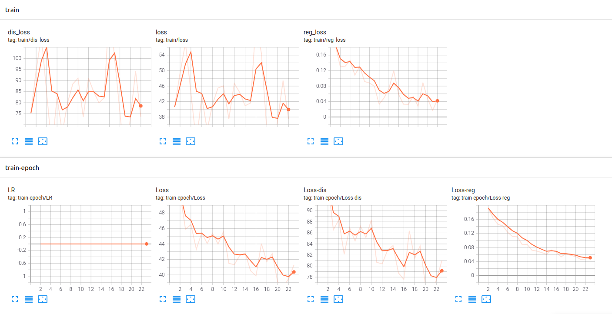

# An-Implementation-PRSnet


this reposity aims to implement the PRS NET [[Code](https://github.com/IGLICT/PRS-Net)]  [[My Impl](https://github.com/WANGSSSSSSS/An-Implementation-PRSnet)]  [[Paper](https://arxiv.org/abs/1910.06511)]


时间规划：

- [x] Context 基本控制逻辑
- [x] Model 实现
- [x] Model 调试
- [x] Loss 实现
- [x] Loss 调试
- [x] dataset 实现（随机生成数据）
- [x] dataset 调试
- [x] 四元数 辅助函数
- [x] 可视化 训练曲线
- [ ] validation 后处理
- [ ] 进行训练
- [ ] 测试结果

## Usage :

```bash
python3 ./main.py Train 
python3 ./main.py --help
```

**可视化训练曲线 ：**

```python
tensorboard --logdir=./log
```



相关算法具体内容，可以访问[WIKI](https://github.com/WANGSSSSSSS/An-Implementation-PRSnet/wiki)

