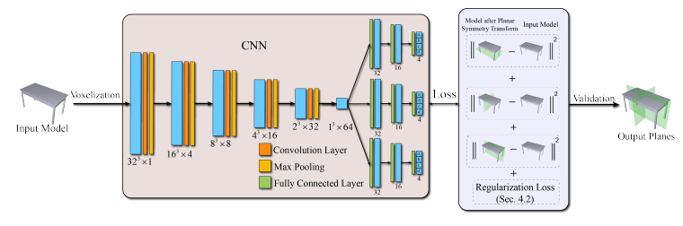
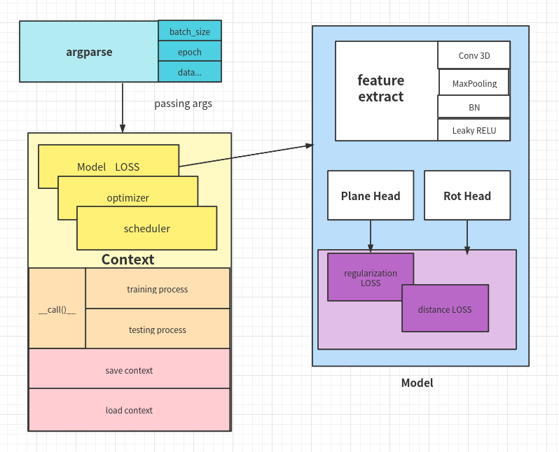
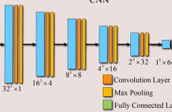

# An-Implementation-PRSnet
this reposity aims to implement the PRS NET [[CODE](https://github.com/IGLICT/PRS-Net)]  [[MY Impl](https://github.com/WANGSSSSSSS/An-Implementation-PRSnet)]



时间规划：

- [x] Context 基本控制逻辑
- [x] Model 实现
- [x] Model 调试
- [x] Loss 实现
- [ ] Loss 调试
- [ ] dataset 实现
- [x] 四元数 辅助函数
- [ ] validation 后处理
- [ ] 进行训练
- [ ] 测试结果

## 辅助函数

### 四元数

* 四元数乘法

  给定两个四元数$P = \{p_0, \vec{p}\}$,  $Q = \{q_0, \vec q\}$

  四元数乘积：$X = PQ = \{p_0q_0 - \vec p.\vec q, p_0\vec q+q_0\vec p + \vec p \cross \vec q\}$

  根据这个公式，可以用矩阵乘法来加速四元数计算

  ```python
  def product(q1, q2):
      b,n,_ = q1.shape
      q1 = q1.view(-1,1,4)
      q2 = q2.view(-1,1,4)
      p = torch.zeros([b*n,4])
      p[:,0] = q1[:,0,0] * q2[:,0,0] - torch.matmul(q1[:,:,1:], 				torch.transpose(q2[:,:,1:],1,2))[:,0,0]
      p[:,1:] = q1[:,0,:1].repeat(1,1,3) * q2[:,0,1:] +\
                q1[:,0,1:]*q2[:,0,:1].repeat(1,1,3) + \
                  torch.cross(q1[:,:,1:], q2[:,:,1:])[:,0,:]
      return p.reshape(b,n,4)
  ```

* 四元数求逆

  使用单位四元数的时候，单位四元数的共轭和逆是同一个

  ```python
  def quat_conjugate(quat):
    q_conj = quat
    q_conj[:, :, 1:] *= -1
    return q_conj
  ```

  

## 整体框架设计



### Argsparse

利用argparse包，来输入需要的参数变量

### Context 上下文控制

用于控制训练过程，包含存储，加载checkpoint，打印训练信息，利用tensorBoard，可视化训练曲线

### RPS-net

```python
class Net(nn.Module):
    def __init__(self, pn, rn, bn):
        super(Net, self).__init__()

        self.bn = self.selectBN(bn)
		{
            self.fex = .... # 在下面
        }
        self.Plane = PlaneHead(pn, 64)
        self.Rot = RotHead(rn, 64)

    def forward(self, voxel):
        #print(voxel.shape)
        feature = self.fex(voxel)
        feature = feature.view(-1, 64)
        #print(feature.shape)
        Plane = self.Plane(feature)  # a, b,c,d  shape: [n,[b, 4]]
        Rot = self.Rot(feature)      # \pi x,y,z shape: [n,[b, 3]]

        return Plane, Rot

    def selectBN(self, name):
        if name == "bn":
            return torch.nn.BatchNorm3d
        elif name == "Lbn":
            return torch.nn.LayerNorm
        else:
            pass
        print("unexpected batchNorm layer in Net.selectBN")
        exit()
```


#### feature extractor



```python
		self.fex = nn.Sequential()
        self.fex.add_module("[32, 16, 1, 4]-1", nn.Conv3d(1, 4,  (3,3,3), 1, 1))
        self.fex.add_module("[POOL, 2]-1", nn.MaxPool3d(2))
        self.fex.add_module("[BN]-1", self.bn(4))
        self.fex.add_module("[activate Leaky RELU]-1", nn.LeakyReLU())


        self.fex.add_module("[16, 4, 8]-2", nn.Conv3d(4, 8,  (3,3,3), 1, 1))
        self.fex.add_module("[POOL, 2]-2", nn.MaxPool3d(2))
        self.fex.add_module("[BN]-2", self.bn(8))
        self.fex.add_module("[activate Leaky RELU]-2", nn.LeakyReLU())


        self.fex.add_module("[8, 8, 16]-3", nn.Conv3d(8, 16, (3,3,3), 1, 1))
        self.fex.add_module("[POOL, 2]-3", nn.MaxPool3d(2))
        self.fex.add_module("[BN]-3", self.bn(16))
        self.fex.add_module("[activate Leaky RELU]-3", nn.LeakyReLU())

        #
        self.fex.add_module("[4, 16,32]-4", nn.Conv3d(16, 32,(3,3,3), 1, 1))
        self.fex.add_module("[POOL, 2]-4", nn.MaxPool3d(2))
        self.fex.add_module("[BN]-4", self.bn(32))
        self.fex.add_module("[activate Leaky RELU]-4", nn.LeakyReLU())


        self.fex.add_module("[2, 32,64]-5", nn.Conv3d(32, 64,(3,3,3), 1, 1))
        self.fex.add_module("[POOL, 2]-5", nn.MaxPool3d(2))
        self.fex.add_module("[BN]-5", self.bn(64))
        self.fex.add_module("[activate Leaky RELU]-5", nn.LeakyReLU())
```


#### Plane Head

```python
class PlaneHead(nn.Module):
    def __init__(self, n, in_cn):
        super(PlaneHead, self).__init__()
        self.expect_n = n
        self.transfrom = []
        init_bias = [[1,0,0,0], [0,1,0,0], [0,0,1,0]]
        for i in range(n):
            self.transfrom.append(nn.Sequential())
            self.transfrom[-1].add_module("Plane Linear-1-"+str(i), 					nn.Linear(in_cn, in_cn//2))
            self.transfrom[-1].add_module("activate Layer-1-							"+str(i), nn.LeakyReLU())
            self.transfrom[-1].add_module("Plane Linear-2-"+str(i), 					nn.Linear(in_cn//2, in_cn//4))
            self.transfrom[-1].add_module("activate Layer-2-							"+str(i), nn.LeakyReLU())
            finial = nn.Linear(in_cn//4, 4)
            finial.bias.data = torch.Tensor(init_bias[i])
            self.transfrom[-1].add_module("finial "+str(i), finial)

    def forward(self, feature):
        out = []
        for tran in self.transfrom :
            out.append(tran(feature))
        return out
```


#### Rotatation Head

```python
class RotHead(nn.Module):
    def __init__(self, n, in_cn):
        super(RotHead, self).__init__()
        self.expect_n = n
        self.transfrom = []
        init_bias = [[0,1,0,0], [0,0,1,0], [0,0,0,1]]
        for i in range(n):
            self.transfrom.append(nn.Sequential())
            self.transfrom[-1].add_module("Plane Linear-1-" + 						str(i), nn.Linear(in_cn, in_cn // 2))
            self.transfrom[-1].add_module("activate Layer-1-", 						nn.LeakyReLU())
            self.transfrom[-1].add_module("Plane Linear-2-" + 						str(i), nn.Linear(in_cn // 2, in_cn // 4))
            self.transfrom[-1].add_module("activate Layer-2-", 						nn.LeakyReLU())
            finial = nn.Linear(in_cn // 4, 4)
            finial.weight.data *= 0
            finial.bias.data = torch.Tensor(init_bias[i])
            self.transfrom[-1].add_module("Plane Linear " + str(i), 			finial)
            #self.transfrom[-1].add_module("activate Layer", nn.LeakyReLU())

    def forward(self, feature):
        out = []
        for trans in self.transfrom:
            out.append(trans(feature))
        return out
```


#### Distance LOSS

**目前没有数据，LOSS没有调试**

* reflection plane

  $q_k^* = q_k - 2{q_k.n_i+d_i\over|n_i|^2}n_i$

* rotation axis

  $q_k^* = P_jq_k{P_j}^{-1}$

计算得到新的点，求出它所在的voxel格子，估计距离等于该点与体素中心的距离

```python
class DistanceLoss(nn.Module):
    def __init__(self, samples):
        super(DistanceLoss, self).__init__()
        self.N = samples
        self.valid = False
    def forward(self, samples, close_point, voxel, plane, rot):
        plane_loss = torch.Tensor([0])
        rot_loss = torch.Tensor([0])
        #TODO 处理损失函数
        for p in plane :
            _points = self.planeTrans(samples, plane)
            inds = self.point2Ind(_points)
            targets = self.closePoins(close_point, inds)
            mask = self.mask(voxel, inds)
            plane_loss += self.distance(_points, targets, mask)

        for r in rot :
            _points = self.rotTrans(samples, rot)
            inds = self.point2Ind(_points)
            targets = self.closePoins(close_point, inds)
            mask = self.mask(voxel, inds)
            rot_loss += self.distance(_points, targets, mask)

        return plane_loss + rot_loss

    def planeTrans(self, point, plane):
        abc = plane[:, 0:3].unsequeeze(1).repeat(1, self.N, 1)
        d = plane[:, 3:].unsqueeze(1).repeat(1, self.N, 1)
        up = torch.sum(point*abc, 2, True) + d
        down  = torch.sum(abc**2, 2, True) + 1e-5
        factor = up/down*2
        new_point = point - factor*abc
        return new_point

    def rotTrans(self, point, quat):
        quat = quat.unsqueeze(1).repeat(1, self.N, 1)
        _zeros = torch.zeros_like(quat[:, 0:1])
        quat_point = torch.cat([_zeros, point], dim=2)
        quatT = quat_conjugate(quat)
        new_point = product(quat, quat_point)
        new_point = product(new_point, quatT)
        return new_point
    def distance(self, preds, targets, mask):
        return torch.sum((preds - targets)**2*mask, dim=[1,2])

    @staticmethod
    def closePoins(closePoints, ind):
        ind = ind.unsqueeze(1).repeat(1,1,3)
        cp = torch.gather(closePoints, 1, ind)
        return cp
    @staticmethod
    def mask(voxel, ind):
        voxel = voxel.view(-1, 32*32*32)
        _voxel = torch.gather(voxel, 1, ind)
        mask = _voxel
        return mask

    @staticmethod
    def point2Ind(point):
        upBound = 0.5
        lowBound = -0.5
        inds = (point - lowBound) / (upBound - lowBound) * 32
        inds = torch.rand(torch.clamp(inds, min=0, max=31))
        indx, indy, indz = inds[:,:,0], inds[:,:,1], inds[:, :,2]
        return indx*indy*indz
```

#### Regularization LOSS

对于回归的平面或者四元数参数，要求不同的回归尽量正交，这样可以避免回归结果坍缩到同一个解

```python
class Regularization(nn.Module):
    def __init__(self):
        super(Regularization, self).__init__()
        self.Id = torch.eye(3, requires_grad=False).unsqueeze(0)
    def forward(self, plane, rot):
        M1 = plane[:, :, :-1]
        M1 = F.normalize(M1, dim=2)
        M2 = rot[:, :, 1:]
        M2 = F.normalize(M2, dim=2)
        A = torch.matmul(M1, torch.transpose(M1,1,2)) - self.Id
        B = torch.matmul(M2, torch.transpose(M2,1,2)) - self.Id
        return torch.sum((A**2 + B**2), dim=(1,2))
```

